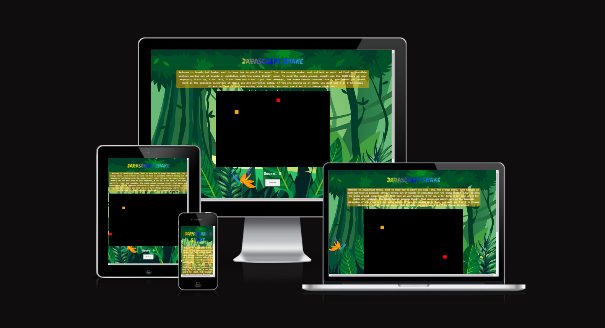
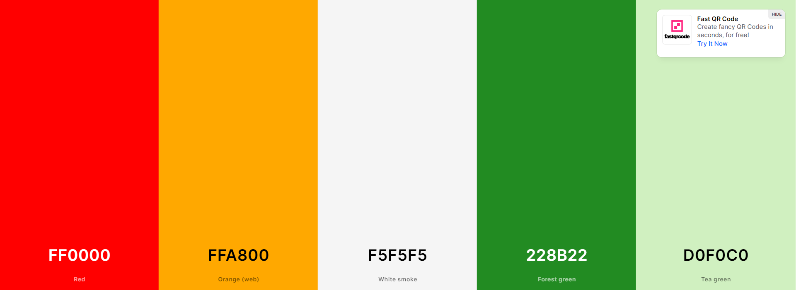
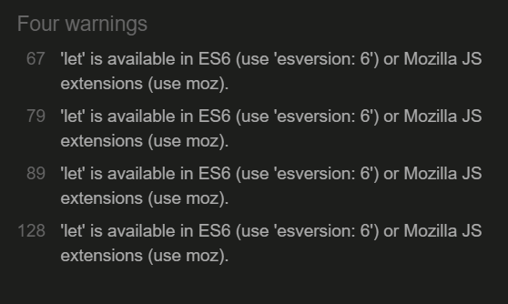
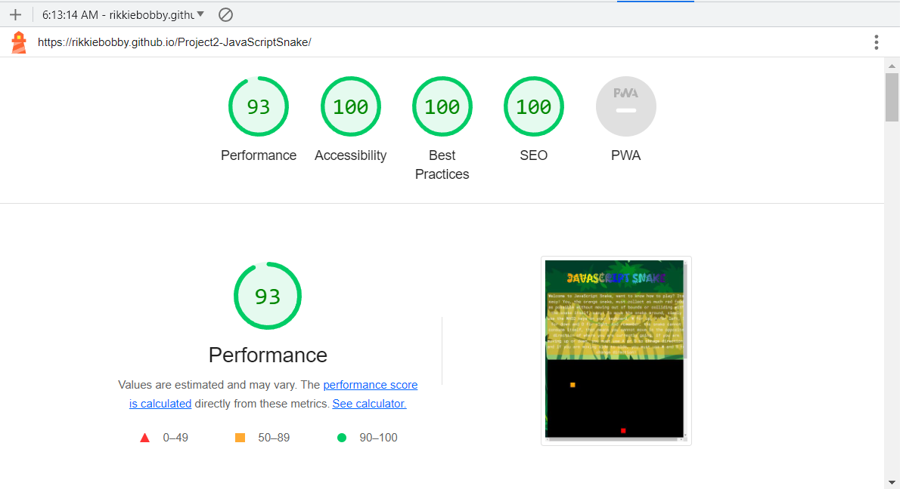
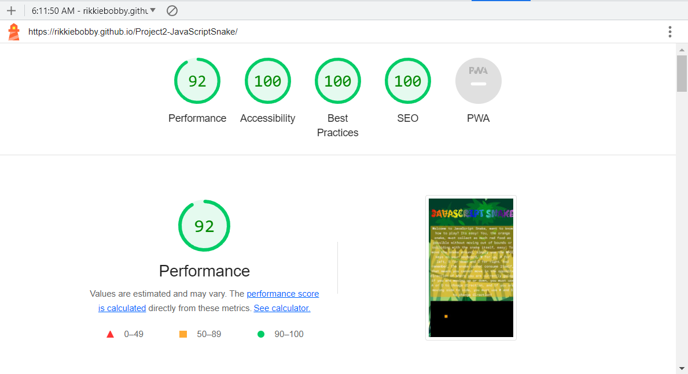

# JavaScript Snake
JavaScript Snake is an interactive website designed and targeted for kids. The site itself is primarilly aimed at children between the ages of 7-11 years old, the site can be used as a way to help sharpen their reflexs by playing the game while also adding a competitive element by trying to get the best score, it can also be used to help them become familiar with using a keyboard.

You can find the live site [here](https://rikkiebobby.github.io/Project2-JavaScriptSnake/).


# Contents
+ [User Experience](#user-experience)
  + [User Stories](#user-stories)
  + [Design](#design)
    + [Overall Feel](#overall-feel)
    + [Colour Scheme](#colour-scheme)
    + [Typography](#typography)
    + [Sound](#sound)
+ [Features](#features)
  + [Current Features](#current-features)
  + [Possible Future Features](#possible-future-features)
+ [Technologies Used](#technologies-used)
  + [Languages Used](#languages-used)
  + [Frameworks Libraries & Programmes Used](#frameworks-libraries-and-programmes-used)
+ [Testing](#testing)
  + [Validator Testing](#validator-testing) 
  + [Lighthouse Testing](#lighthouse-testing)
  + [Other Testing](#other-testing)
+ [Deployment](#deployment)
  + [Deployment through GitHub Pages](#deployment-through-gitHub-pages)
  + [Forking the Repository](#forking-the-repository)
  + [Cloning Project](#cloning-project)
+ [Credits](#credits)
  + [Content](#content)
  + [Media](#media)
  + [Acknowledgements](#acknowledgements)
---
---
# User Experience
## User Stories
#### As a child user: 
+ I want to be able to easily navigate through the site. 
+ I want to be able to see my score as the game progresses.
+ I want to understand the rules of the game.
+ I want to be able to control the directions of the snake. 
+ I want to easily replay the game once I have completed a game. 
#### As a parent: 
+ I want my child to be able to test their reflexes.
+ I want the site to be easy to navigate through so that my child does not require assistance with the UI. 
+ I want my child to feel a sense of acomplishment when playing.
## Design
### Overall Feel
The overall feel of the website was create a type of jungle theme that would be appealing to younger children who the site is aimed at. The background graphic helps to make the webpage more inviting.
### Colour Scheme
As stated before, the overall theme was to create a jungle style for the snake game while also giving enough contrast to make the page more interesting and allowing the text to be readable, so I used a mix of greens, red and orange to convey this while keeping the text white to be more clearer

### Typography
In keeping with the jubgle theme, I decided to use the [kablammo](https://fonts.google.com/specimen/Kablammo?query=kablammo) for headings to give the page a playful and edgy look, and for the text in the body I used [orbit](https://fonts.google.com/specimen/Orbit?preview.text=howiye&preview.text_type=custom&query=orbit) as I liked the way it conveyed a slightly retro style similar to old school space invaders.
---
---
# Features
## Current Features
+ All pages fully reponsive on all screen sizes.
+ Fully functioning links to social media which will open in a new tab.
+ Randomised placement of the "food" on the game board.
+ Continuous score updates as the game progresses.  
## Possible Future Features
+ The site could use some optional buttons to function as arrow controls to make use on smart phones and tablets easier.
+ I'd like to include a leaderboard so that children could show each others friends and add a competitive element to the game.
+ A submit form where scores could be sent to users emails
+ A form to signup for a newsletter
---
---
# Technologies Used
## Languages Used
+ [HTML5](https://en.wikipedia.org/wiki/HTML5)
+ [CSS3](https://en.wikipedia.org/wiki/CSS)
+ [JavaScript](https://en.wikipedia.org/wiki/JavaScript)
## Frameworks Libraries and Programmes Used
+ [Font Awesome](https://fontawesome.com/) used for icons.
+ [GitHub](https://github.com/) used to host repository.
+ [GitPod](https://www.gitpod.io/) used to develop project and organise version control.
+ [GitHub Pages](https://pages.github.com/) Pages used to deploy the site.
+ [Lighthouse](https://developers.google.com/web/tools/lighthouse) for performance review.
+ [PowerMapper](https://www.powermapper.com/) used to check compatibility with older browsers.
+ [AmIResponsive](https://ui.dev/amiresponsive) used to check site was responsive on different screen sizes.
---
---
# Testing
## Validator Testing
At the completion or heavy editing of sections, I used the following to check my code for syntax errors:
+ [HTML](https://validator.w3.org/) 
  + All pages came back with no errors.
+ [CSS](https://jigsaw.w3.org/css-validator/)
  + CSS came back with no errors. 
  + CSS did display warnings but they're all in relation to vendor prefixes. 
+ [JavaScript](https://jshint.com/)

  + JavaScript did display some lines of code which were missing semi-colons at the end of statements which were fixed

    
  + The validator did display these warnings of let being available, however this did not affect the code in any breaking way

    
## Lighthouse Testing
I used Chromes Lighthouse tools to test site performance. I check bothed desktop and mobile performances. Below are the screenshots from both tests:
### Lighthouse Desktop

### Lighthouse Mobile

## Bugs and Fixes
+ One bug which I encountered was that when the snake game was linked up to be played using the arrow keys on the keyboard, it would move the webpage up and down and side to side which made it difficult to react to what was happening, to fix this I decided to switch from using the arrow keys in the change direction function to the WASD keys instead which solved the issue easily.
+ another bug I encountered was the appearence of and x scroll on the webpage which was not intended to be there, though small, it does distract from the user experience slightly. I tried fixing this by reducing the with of the body in CSS, but made the page look rather messy, still working on a fix for this at the moment.
# Deployment
## Deployment through GitHub Pages
This site was deployed through GitHub Pages using the following steps:
+ Log into GitHub.
+ Locate the repository.
+ Locate the settings option along the options bar.
+ Locate GitHub Pages options towards the bottom of the page.
+ In 'Source' dropdown, select 'Master' from the branch options.
+ Click the save button.
+ The site is now published though it may not be accessible straight away.
+ The site URL will be visible on the green bar under the section header. This will remain there permanently and you can refer back to it at any time.
## Forking the Repository
+ Log in to GitHub and locate the GitHub Repository
+ At the top of the Repository just above the "Settings" Button on the menu, locate the "Fork" Button.
+ You will have a copy of the original repository in your GitHub account.
+ You will now be able to make changes to the new version and keep the original safe. 
## Making a Local Clone
+ Log into GitHub.
+ Locate the repository.
+ Click the 'Code' dropdown above the file list.
+ Copy the URL for the repository.
+ Open Git Bash on your device.
+ Change the current working directory to the location where you want the cloned directory.
+ Type ```git clone``` in the CLI and then paste the URL you copied earlier. This is what it should look like:
  + ```$ git clone https://github.com/RikkieBobby/Project2-JavaScriptSnake.git```
+ Press Enter to create your local clone.
---
---
# Credits
## Code
+ A big thank you to Kenny Yip for supplying a tutorial on youtube on how to create the snake game in JavaScript and helping me learn how to use variations and functions effectivly [KennysTutoial](https://www.youtube.com/watch?v=baBq5GAL0_U&t=1039s)
+ I'd also like to thank w3docs for supplying the code which I used to create the multicolor effect on the main-heading on the page [w3docs](https://www.w3docs.com/snippets/css/how-to-create-a-multicolor-text-in-html-and-css.html#:~:text=This%20is%20the%20easiest%20way,names%20of%20your%20preferred%20colors)
+ code institute for supplying the extremely helpful walk through video of the love maths project by Anna Greaves
+ Freepik for supplying the background used on the page [freepik](https://www.freepik.com/free-vector/detailed-jungle-background_13817745.htm#query=jungle&position=37&from_view=keyword&track=sph#position=37&query=jungle)
## Content
All content was written by Richard Nolan (website creator)
## Acknowledgements
+ A big thank you to my friends Joe and Hannah for being their to support me when I felt I was struggling with the work.
+ To my mom and dad also for helping me get started on this journey
+ To my fellow student of CI Aurelien Lesage for providing me with support and knowledge when I needed it.
+ And fianlly my mentor Antonio Rodriguez for his patience and support throughout this whole time and helping me move step by step through these projects.